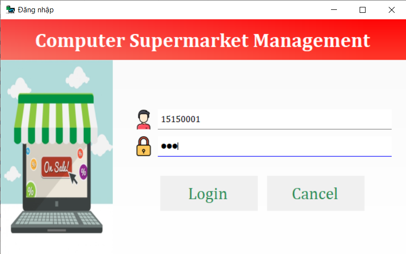
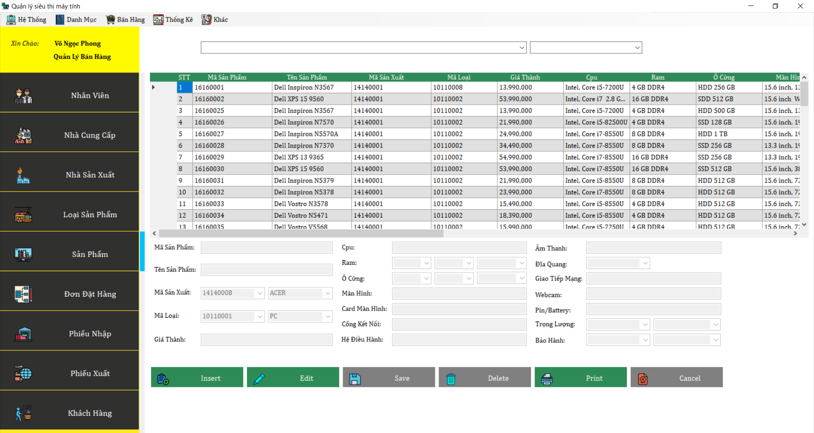

# Quản lý siêu thị máy tính

 
 
 
 
 
 
 

## Giới thiệu
- Phần mềm quản lý siêu thị máy tính là việc áp dụng công nghệ thông tin vào việc quản lý và bán hàng trong các cửa hàng và siêu thị máy tính. 
- Với phần mềm quản lý siêu thị máy tính này nó giúp cho người sử dụng hay tổ chức sử dụng tiết kiệm chi về nhân lực bán hàng, tiết kiệm thời gian và có tính bảo mật cao. 
- Phần mềm giúp tổ chức sử dụng lên kế hoạch dựa trên số lượng được lưu trữ ở phần mềm và dễ dàng đưa ra các báo cáo quản lý bán hàng mang tính chất cốt lõi nhằm giải quyết những nút thắt trong quy trình kinh doanh. 
- Phần mềm giúp hạn chế tối đa sai sót trong quá trình bán hàng và tiết kiệm thời gian cho người sử dụng. 
- Phần mềm giúp quản lý, giám sát tình trạng hoạt động làm việc của nhân viên, tình trạng hàng hóa, tình trạng bán hàng qua đó đưa ra cách xử lý phù hợp nhất, giúp việc bán hàng hay kinh doanh đặt hiệu quả cao nhất.

## Công nghệ sử dụng
- ADO.NET
- LinQ to SQL

## Giao diện và chức năng
### 1. Màn hình đăng nhập
Để đảm bảo tính bảo mật cho việc sử dụng, giúp phân cấp quyền người sử dụng, mỗi khi khởi động ứng dụng hoặc kết thúc phiên làm việc, người sử dụng được yêu cầu đăng nhập lại ứng dụng.

### 2. Giao diện chính
Đây là môi trường giao diện tương tác chính với người dùng. Được phân chia thành các mục, tương ứng với từng chức năng chính của ứng dụng.
- Nhóm chức năng quản trị: Đăng xuất để kết thúc phiên làm việc, thoát để đăng xuất và thoát khỏi phần mềm.
- Nhóm chức năng thao tác: Thêm, xóa, sửa, in, tìm kiếm các đối tượng Nhân Viên, Nhà Cung Cấp, Nhà Sản Xuất, Loại Sản Phẩm, Sản Phẩm, Đơn Hàng, Phiếu Nhập, Phiếu Xuất, Khách Hàng, Phân Quyền.
- Nhóm chức năng thông tin: Xem thông tin chi tiết các đối tượng kể ở trên, thông kế đơn hàng, nhập hàng, xuất hàng, tồn kho.

### 3. Các màn hình chức năng

  
Mô tả

#### 3.1. Màn hình nhân viên

#### 3.2. Màn hình nhà cung cấp

#### 3.3. Màn hình nhà sản xuất

#### 3.4. Màn hình loại sản phẩm

#### 3.5. Màn hình sản phẩm

#### 3.6. Màn hình đơn đặt hàng

#### 3.7. Màn hình phiếu nhập

#### 3.8. Màn hình phiếu xuất

#### 3.9. Màn hình khách hàng

#### 3.10. Màn hình phân quyền

#### 3.11. Màn hình thống kê

